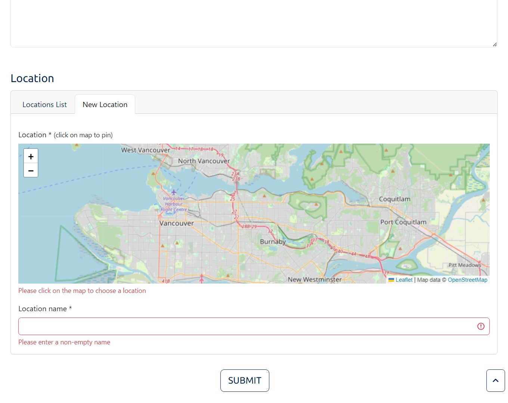

<!-- PROJECT LOGO -->
<div align="center">
  <a href="https://github.com/andreihar/nct">
    
  </a>
  
# Night Crusade Titans


<!-- PROJECT SHIELDS -->
[![Contributors][contributors-badge]][contributors]
[![Licence][licence-badge]][licence]
[![LinkedIn][linkedin-badge]][linkedin]

**A superhero-themed app for reporting and managing public nuisances in the Lower Mainland**

App to allow report of public nuisances. This Angular-based app features a robust set of functionalities, including a data table, report management, map display, and more.

[Demo][demo]

</div>


---


<!-- TABLE OF CONTENTS -->
<details open>
  <summary>Table of Contents</summary>
  <ol>
    <li>
      <a href="#about-the-project">About The Project</a>
      <ul>
        <li><a href="#built-with">Built With</a></li>
      </ul>
    </li>
	<li><a href="#install">Install</a></li>
    <li>
      <a href="#features">Features</a>
      <ul>
        <li>
          <a href="#home-page">Home Page</a>
          <ul>
            <li><a href="#map-display">Map Display</a></li>
			<li><a href="#data-list">Data List</a></li>
          </ul>
        </li>
		<li><a href="#report-management">Report Management</a></li>
		<li><a href="#report-creation">Report Creation</a></li>
      </ul>
    </li>
    <li><a href="#contributors">Contributors</a></li>
    <li><a href="#acknowledgements">Acknowledgements</a></li>
    <li><a href="#licence">Licence</a></li>
  </ol>
</details>


<!-- ABOUT THE PROJECT -->
## About The Project

Night Crusade Titans is the final project created for the course in Client-side Development in the Fall semester of 2023.

### Built With

* [![Angular][angular-badge]][angular]
* [![Bootstrap][bootstrap-badge]][bootstrap]
* [![Leaflet][leaflet-badge]][leaflet]


<!-- INSTALL -->
## Install

Run the app locally:

```bash
$ npm install
$ ng serve -o
```

The website can be accessed through the URL `http://localhost:4200/`.


<!-- FEATURES -->
## Features

### Home Page

The Home Page serves as the central hub for users to navigate through different aspects of the application. It includes a switch for toggling between the Map and Data List views.

<p align="center">

</p>

#### Map Display

A map displays all reported nuisances on an interactive map with markers. Users can interact with the markers to view the number of reports for each location.

<p align="center">

</p>

#### Data List

A list presents a dynamic data table listing all nuisance reports. Users can sort the data by Time, Name, and Location. This provides a detailed and sortable overview of reported incidents.

<p align="center">

</p>

### Report Management

Users can modify the report status or delete reports with a valid passcode ("BaggyJeans"). The app uses MD5 hash for password verification.

<p align="center">

</p>

### Report Creation

Users can generate reports through a "CREATE NUISANCE REPORT" button, revealing a user-friendly report form.

<p align="center">

</p>


<!-- CONTRIBUTORS -->
## Contributors

- Andrei Harbachov ([GitHub][andrei-github] · [LinkedIn][andrei-linkedin])


<!-- ACKNOWLEDGEMENTS -->
## Acknowledgements

- [Hashify][hashify] - used to generate an MD5 hash to verify password.


<!-- LICENCE -->
## Licence

Because Night Crusade Titans is MIT-licensed, any developer can essentially do whatever they want with it as long as they include the original copyright and licence notice in any copies of the source code.


<!-- MARKDOWN LINKS -->
<!-- Badges and their links -->
[contributors-badge]: https://img.shields.io/badge/Contributors-1-44cc11?style=for-the-badge
[contributors]: #contributors
[licence-badge]: https://img.shields.io/github/license/andreihar/taibun.svg?color=000000&style=for-the-badge
[licence]: LICENSE
[linkedin-badge]: https://img.shields.io/badge/LinkedIn-0077B5?style=for-the-badge&logo=linkedin&logoColor=white
[linkedin]: https://www.linkedin.com/in/andrei-harbachov/
[angular-badge]: https://img.shields.io/badge/Angular-b52e31?style=for-the-badge&logo=angular
[angular]: https://angular.io/
[bootstrap-badge]: https://img.shields.io/badge/Bootstrap-7b12f8?style=for-the-badge&logo=bootstrap&logoColor=ffffff
[bootstrap]: https://getbootstrap.com/
[leaflet-badge]: https://img.shields.io/badge/Leaflet-199900?style=for-the-badge&logo=leaflet
[leaflet]: https://leafletjs.com/

<!-- Technical links -->
[demo]: https://github.com/andreihar/nct
[hashify]: https://hashify.net/

<!-- Socials -->
[andrei-linkedin]: https://www.linkedin.com/in/andrei-harbachov/
[andrei-github]: https://github.com/andreihar